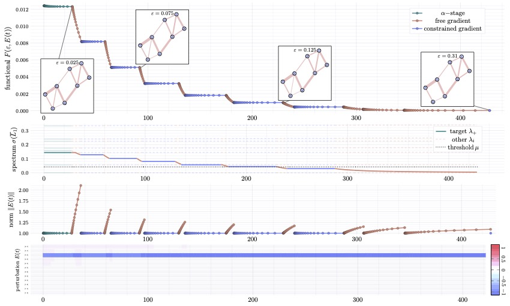

# HOLaGraF: Topological Stability for higher-order graph Laplacian operators

This repository provides the code for **H**igher-**O**rder **La**placian **Gra**dient  **F**low for "Quantifying the structural stability of simplicial homology" by _Nicola Guglielmi_, _Anton Savostianov_ and _Francesco Tudisco_.

> We provide the documentation and examples for the implementation of the gradient flow algorithm in `julia`. The implementation in `matlab` that supports a similar code structure will be uploaded later. 

## Background

We advise to consult the companion paper:

> "*Quantifying the structural stability of simplicial homology*" by **Nicola Guglielmi**, **Anton Savostianov** and **Francesco Tudisco**.

Current work defines the topoligical stability of the homology group on generalized networks: briefly,  we aim to increase the number of **1-dimensional holes** in the simplicial complex $\mathcal{K}$ though increasing the dimension of the kernel of corresponding higher-order Laplacian operator $\overline{L}_1$  formed by boundary operators $B_1$ and $B_2$, weighted and normalized.

The minimal perturbation $(\varepsilon, E)$ affecting the graph's homology is found through the gradient flow optimization of the target **spectral** functional:

$$
 F(\varepsilon, E) = \frac{1}{2} \lambda_+^2(\overline{L}_1) + \frac{\alpha}{2} \max \left( 0, 1-\frac{\mu_2(L_0)}{\mu} \right)^2
$$


## Minimal working example

Here we provide a minimal working example of the **alternating constrained- and free- gradient flow optimization procedure** developed in the paper.

```julia
using BenchmarkTools, Printf  # quality of life libs
using LinearAlgebra, Arpack
include("HOLaGraF_lsmr.jl")  # import of the main library
using .HOLaGraF_lsmr
```
The graph is defined by the list *edges*, *triangles* (read from files) and *number of vertices*. Weights of the edges are assigned manually; initial perturbation `e` (the diagonal of `E(t)`) is given with a zero-initial norm:
```julia
n = 8;
edges = readMatrix("julia/example/8.edges")
trigs = readMatrix("julia/example/8.trigs")
w = reshape([0.5; 0.95; 1.0; 1.0; 1.0; 1.1; 1.1; 1.1; 1.05; 0.31; 1.05; 0.9].^2, :, 1);
ε0 = 1e-8; e = -ones(size(w, 1)); e = e/norm(e, 2);

G=NiceGraph(n, edges, trigs, w, ε0, e, nothing);
```
The mutable structure (class-like) generates the network in form of `B1` and `B2` boundary operators and `points` object generated with the spring layout (unless specified by the user).

The sturcture `Thresh` constains parameters of the functional `α` (will be changed throughout the alpha-phase) and `μ` (given as a share of the initial algebraic connectivity):
```julia
L0 = getL0(G);
μ = eigs(L0, nev = 2, which = :SR)[1][2];
thrs = Thresh( 0.75*μ, 1.0 );
```
In order to run the algorithm, it is sufficient to call the function `wrapper`: it follows the algorithm defined the paper:


```julia
include("wrapper.jl");
inFun = placeL1up(I(size(G.edges, 1)));   # example run without the preconditioner

h0 = 0.1;
ε_Δ=0.025;
G.eps0 = ε_Δ;

logSizes = Vector{Float64}(); logSteps = Vector{Float64}(); logTrack = Vector{Float64}();
logE = Array{Float64}(undef, size(G.w, 1), 0); logΛ = Array{Float64}(undef, size(G.w, 1), 0);

α_st, α_fin = 1.0, 100.0;

@time G, thrs, logSizes, logSteps, logTrack, logE, logΛ = wrapper(G, h0, α_st, α_fin, thrs, ε_Δ, logSizes, logSteps, logTrack, logE, logΛ, inFun );
```
+ `logSteps` keeps track of all the steps per iteration;
+ `logSizes` keeps track of number of Euler steps in each iteration;
+ `logTrack` stores decreasing functional along the flow;
+ `logE` stores the perturbation profile along the flow;
+ `logΛ` stores the change of the spectrum

> We do not encourage the usage of  `logΛ` since it calls for a full spectrum at each Euler step. In the computationally demanding cases we suggest avoiding full spectrum computation!



### `NiceGraph.jl` as a graph structure
+ `n`, `edges`, `trigs` – the number of **vertices**, lists of **edges** and **triangles**;
+ `B1`, `B2` – unnormalized initial boundary operators; generated by `B1fromEdges` and `B2fromTrigs` functions;
+ `w` – initial edges' weight profile;
+ `eps0` and `e` – the perturbation norm and the perturbation shape (the main diagonal);
+ `points` – vertices' coordinates; either provided by user or generated by `springLayout`.

### `thrs_struct.jl` as a parameter dictionary
+ `alph` – the penalisation weight from the target functional;
+ `mu` – the threshold for the homological pollution.

## `generateDelaunay.jl` functionality

We also provide the code to sample the triangulation-based synthetic dataset based on the **Delaunay** triangulation.

+ _Vertice samplign and triangulation_: function `generateDelauney(N)` builds a triangulation network with $N+4$ vertices and returns vertices' coordinates with lists of edges and triangles;
+ _Removal an edge from the network_: pair of functions `getIndx2Kill(edges)` and `killEdge(indx, n, edges, trigs)` sample the number of edge to eliminate (without the outer border) and eliminate it from the edge list with all adjacent triangles;
+ _Addition of an edge_: pair of functions `getNewEdge(n, edges)` and  `addEdge(new_edge, n, edges, trigs)` sample a new edge (not yet present in the edge list) and add it to the edge list with all the newly formed triangles.

One can find bulk launch of sampling + **HOLaGraF** run in `fullTriangleRun.jl`.

## Dependencies for `julia` code
Full list of dependecies:
```julia    
using SparseArrays, LinearAlgebra, Arpack, Krylov, ArnoldiMethod  #linear algebra libraries
using SuiteSparse, IncompleteLU, LimitedLDLFactorizations, ILUZero # OPTIONAL: various preconditioners
using LinearMaps, LinearOperators # functional libraries to create linear operators
using GR, StatsBase  # Delaunay triangulation
using DelimitedFiles, DataFrames, CSV # reading from files
using Random, Printf, BenchmarkTools
```